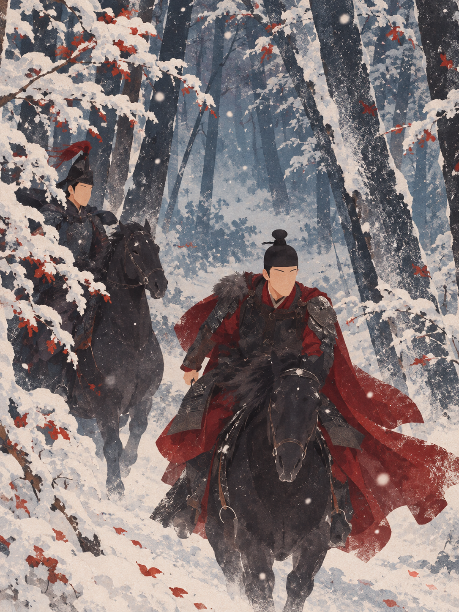
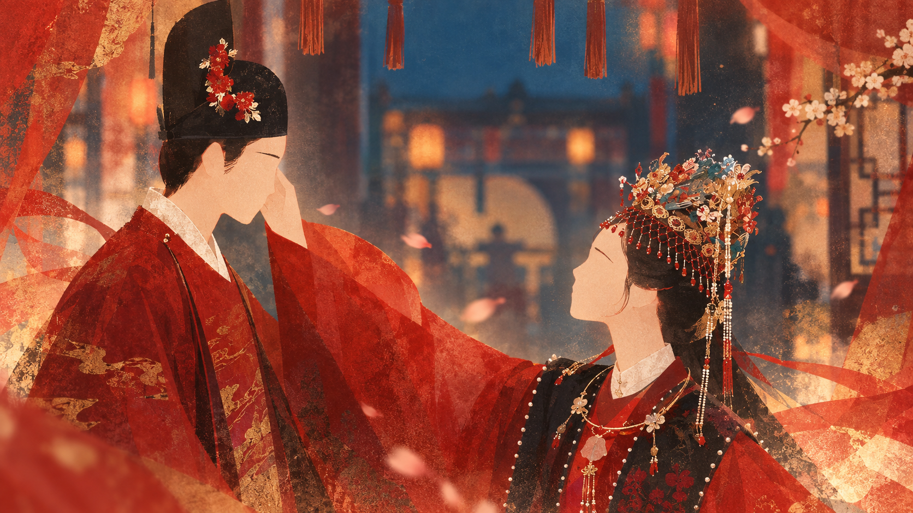
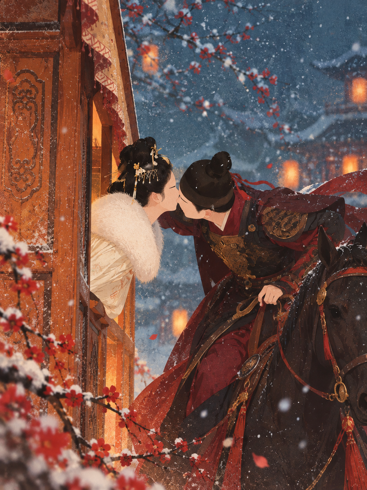
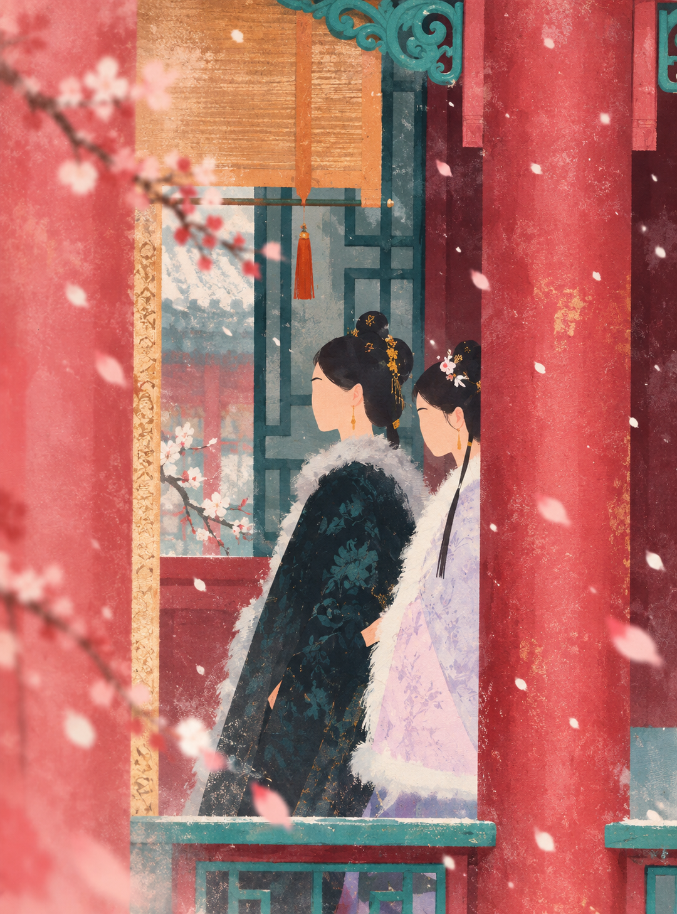
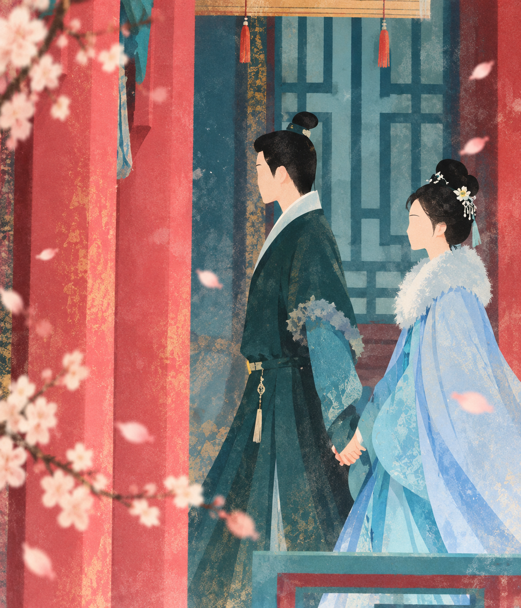
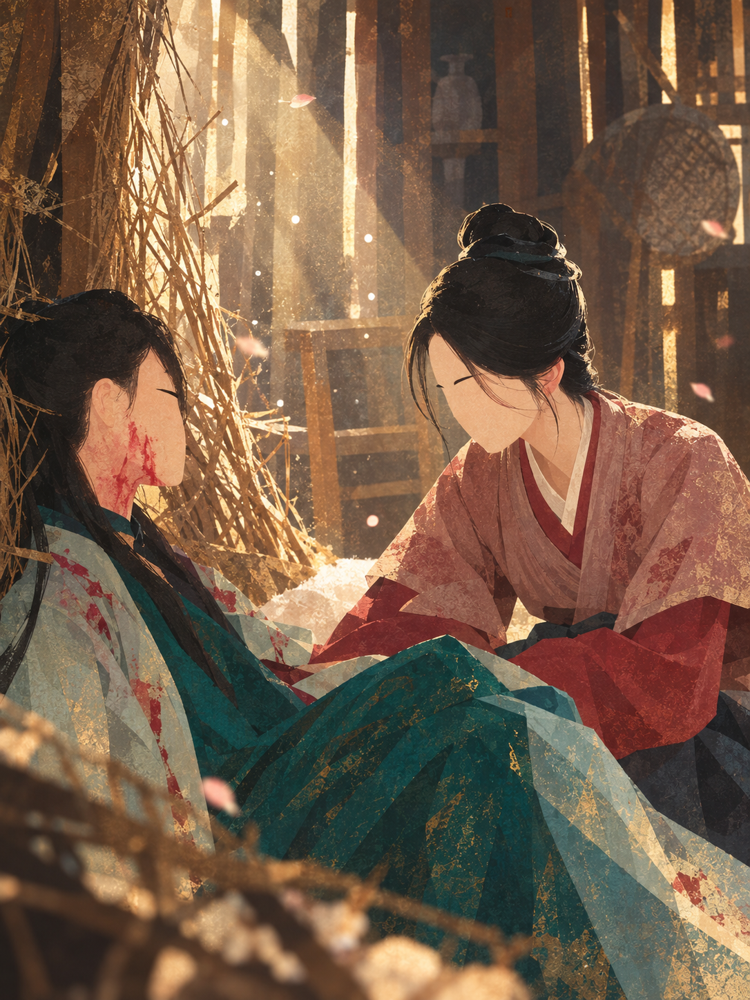

# 兰香古风插画 Skill

将人物照片转换成去脸化、朦胧、色块拼接的中国古典叙事插画。

## 视觉逻辑

- 照片提供人物关系、动作、轮廓、构图和情绪。
- 人物脸部只保留眉形与外轮廓，不生成完整五官。
- 用 4–7 个主色块重构衣服、建筑、头发、雪景和光线。
- 用姿态、色彩、留白和光影传达情绪，不靠写实表情。
- 默认输出 3:4 竖版，并忽略原图中的字幕、贴纸、水印和 UI。

## 案例展示

以下案例展示了 Skill 如何保留照片中的动作、构图、人物关系和情绪，再用去脸化的人物、明确色块、纸张肌理与朦胧光影重构为古风叙事插画。

### 雪林骑行



### 宫门雪吻



### 门前雪吻



### 粉墙回廊



### 携手同行



### 暖屋相守



## 使用

将本目录复制到 Codex 的 skills 目录，然后使用：

```text
$lanxiang-gu-feng-illustration
```

或直接提供照片并说：“用兰香古风插画 Skill 渲染这张图。”

核心文件是 [SKILL.md](SKILL.md)。
